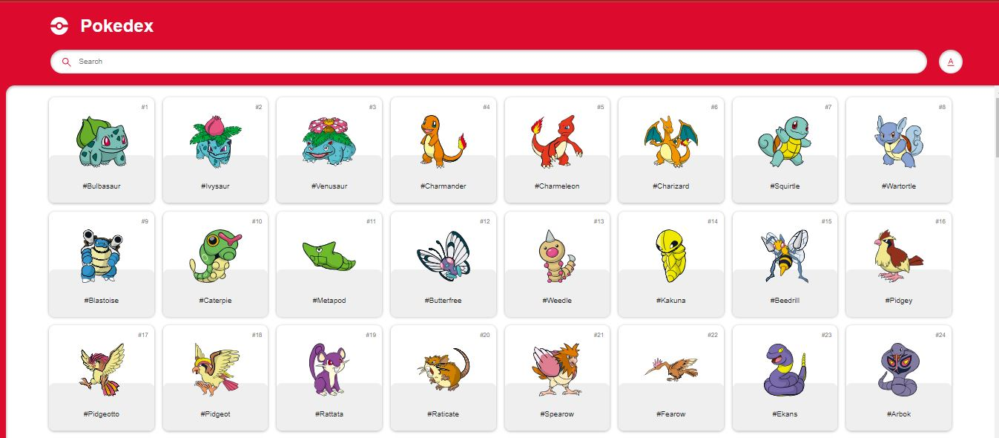

# -Cat-logo-de-Pok-mon-

🎯 Como será a tarefa?

Link da API: https://pokeapi.co/

 ### 
 [Acesse aqui](https://catalogo-pokedex.netlify.app/)

 

Este projeto é baseado ma criação de um site interativo que funcione como um catálogo de informações de Pokémons. Utilizando a API PokeAPI, os estudantes deverão desenvolver uma aplicação web que permita aos usuários visualizar informações e imagens de diferentes Pokémons, por meio de navegação ou pesquisa.

O site deve ser construído com HTML, CSS e JavaScript, focando em práticas de programação front-end e na utilização das requisições da API.

🎯 Objetivos

- Explorar a API PokeAPI: Entender como realizar requisições e manipular dados retornados pela API.
- Desenvolver Habilidades de Front-End: Aplicar conhecimentos de HTML, CSS e JavaScript para criar uma interface de usuário interativa e atraente.
- Implementar Funcionalidades Interativas: Permitir que os usuários pesquisem por Pokémon específicos, vejam suas imagens, características e outras informações relevantes.
- Responsividade e Design: Assegurar que o site seja responsivo e acessível em diferentes dispositivos e tamanhos de tela.
- Criatividade e Inovação:  Criatividade no design e na apresentação das informações, oferecendo uma experiência única para os usuários.

 

🎯 Requisitos Técnicos:

- Integração com a PokeAPI: Usar a API para buscar dados dos Pokémon.
- Funcionalidades de Pesquisa: Implementar um sistema de pesquisa para encontrar Pokémon por nome, tipo, habilidade, etc.
- Exibição de Informações: Mostrar detalhes como nome, imagens, habilidades, tipos, estatísticas de base e qualquer outra informação relevante.
- Design e Estilo: Utilizar CSS para estilizar a interface, com atenção à usabilidade e estética.
- JavaScript Dinâmico: Usar JavaScript para manipulação do DOM, tornando a interface interativa.

🎯 Documentação:

 Documentar o código e as funcionalidades implementada
- Código-fonte no GitHub com documentação adequada.
- Hospedar pelo github pages.

 
